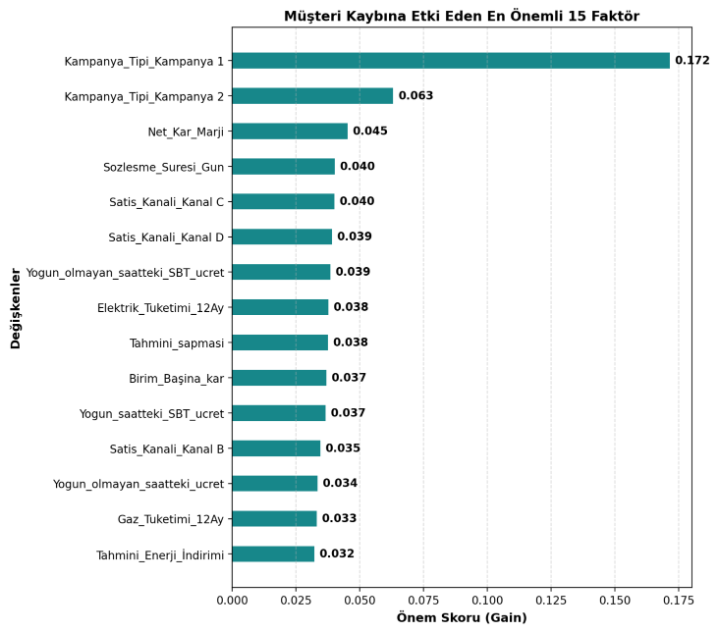
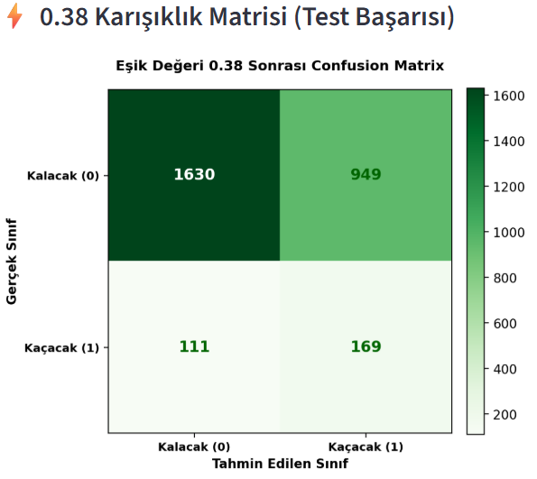

# ⚡ Enerji Sektörü Uçtan Uca Müşteri Kaybı (Churn) Tahmin ve Karar Destek Sistemi

> **SQL Server + Python + XGBoost | Veri Mühendisliği + Makine Öğrenmesi + Karar Destek**

Enerji sektöründe müşteri kaybını (**churn**) gerçekleşmeden önce tahmin etmek, kayıp riskinin ardındaki faktörleri analiz etmek ve yüksek riskli müşteriler için aksiyon alınmasını desteklemek amacıyla geliştirilmiş **uçtan uca bir makine öğrenmesi ve karar destek projesidir.**

Proje; **SQL Server veri mühendisliği**, **EDA**, **iteratif özellik mühendisliği**, **XGBoost**, **threshold tuning**, **model açıklanabilirliği**, **stres testleri** ve **Python tabanlı canlı skorlama** aşamalarını tek bir analitik mimaride birleştirmektedir.

---

## 📌 Proje Özeti

| Alan                       | Kullanılan Teknoloji / Yaklaşım                 |
| -------------------------- | -------------------------------------------------- |
| Veritabanı                | SQL Server                                         |
| Veri İşleme              | SQL, CTE, CASE WHEN                                |
| Veri Analizi               | Python, Pandas                                     |
| Görselleştirme           | Matplotlib, Pandas Styler                          |
| Makine Öğrenmesi         | XGBoost Classifier                                 |
| Model Benchmarking         | Random Forest → XGBoost                           |
| Özellik Mühendisliği    | Türetilmiş davranışsal ve finansal özellikler |
| Model Açıklanabilirliği | XGBoost Feature Importance                         |
| Model Kayıtları          | Pickle (`.pkl`)                                  |
| Canlı Veri Erişimi       | SQLAlchemy                                         |
| Skorlama                   | `predict_proba()`                                |
| Karar Eşiği              | `0.38`                                           |
| Planlanan Arayüz          | Streamlit                                          |

---

# 🏗️ 1. SQL Server Veri Mühendisliği ve Analitik Mimari

Modelleme öncesindeki veri hazırlama ve segmentasyon süreçleri SQL Server üzerinde gerçekleştirilmiştir.

Amaç, Python tarafına mümkün olduğunca **modellemeye hazır ve anlamlandırılmış bir veri seti** aktarmaktır.

```text
┌─────────────────────┐       ┌─────────────────────┐
│    client_data      │       │     price_data      │
│                     │       │                     │
│ Müşteri & Tüketim   │       │ Tarife & Fiyat      │
└──────────┬──────────┘       └──────────┬──────────┘
           │                             │
           └──────────────┬──────────────┘
                          │
                          ▼
              ┌─────────────────────────┐
              │      SQL ANALİTİK       │
              │                         │
              │ CTE + CASE WHEN         │
              │ Tekilleştirme           │
              │ Segmentasyon            │
              │ Veri Temizleme          │
              └────────────┬────────────┘
                           │
                           ▼
              ┌─────────────────────────┐
              │ vw_Final_Churn_Analizi  │
              │                         │
              │ Merkezi Analitik View   │
              └────────────┬────────────┘
                           │
                           ▼
                    Python / ML
```

### SQL İyileştirmeleri

- **Veritabanı izolasyonu:** Analitik nesneler `USE VeriProje;` yapısı altında toplandı.
- **Veri tipi optimizasyonu:** Büyük hacimli tüketim hesaplamalarında taşma problemlerini önlemek amacıyla numerik alanlar `DECIMAL(18,2)` olarak düzenlendi.
- **Aykırı değer temizliği:** Gerçekçi olmayan fiyat değerlerini filtrelemek için `MIN`, `MAX` ve `NULLIF` yapıları kullanıldı.
- **CTE kullanımı:** Geçmiş fiyat ve tarife kayıtlarının müşteri bazında tekilleştirilmesi sağlandı.
- **Segmentasyon:** Ham veriler doğrudan analitik olarak kullanılabilecek müşteri segmentlerine dönüştürüldü.

### Oluşturulan Segmentler

**İndirim Segmenti**

- İndirim almayan
- Standart indirim
- Yüksek indirim

**Kapasite Segmenti**

- Atıl kapasite
- Dengeli kullanım
- Yüksek kapasite

**Müşteri Profil Segmenti**

- Sadece elektrik
- Doğalgaz + elektrik

Merkezi görünüm:

```text
vw_Final_Churn_Analizi
        │
        ├── Müşteri Bilgileri
        ├── Tüketim Bilgileri
        ├── Fiyat Bilgileri
        ├── Segment Bilgileri
        └── Churn Analizi
```

---

# 🔍 2. EDA ve İş Zekası İçgörüleri

Model geliştirilmeden önce verinin davranışını anlamak amacıyla keşifsel veri analizi gerçekleştirildi.

### Öne Çıkan Bulgular

**Hacim vs. Oran Paradoksu**

Toplam ayrılan müşteri sayısında indirimsiz grup öne çıkarken, oransal olarak **yüksek indirim alan müşterilerin churn oranının %12.50 seviyesine ulaştığı** görüldü.

**Peak Saat Fiyat Baskısı**

Churn olan müşterilerin yoğun saatlerde ödediği ortalama birim fiyatın:

```text
Churn Olanlar      : 50.021
Churn Olmayanlar   : 46.391
```

olduğu gözlemlendi.

**Tüketim Karakteristiği**

Devam eden müşterilerin yıllık tüketiminin daha yüksek olduğu belirlendi:

```text
Devam Eden : 164.773 kWh
Ayrılan    :  78.512 kWh
```

Bu sonuç, düşük tüketimli müşterilerin fiyat hassasiyetinin churn davranışında önemli bir faktör olabileceğine işaret etti.

---

# ⚙️ 3. İteratif Feature Engineering

Model performansını artırmak amacıyla özellik mühendisliği tek seferlik değil, **iteratif** olarak gerçekleştirildi.

Başlangıçtaki özellikler değerlendirilerek Recall değerini düşüren gürültülü değişkenler çıkarıldı ve yeni davranışsal özellikler oluşturuldu.

### Oluşturulan Özellikler

| Özellik                   | Açıklama                                                                  |
| -------------------------- | --------------------------------------------------------------------------- |
| `Sozlesme_Suresi_Gun`    | Sözleşme başlangıç ve bitiş tarihleri arasındaki gün sayısı       |
| `Birim_Basina_kar`       | Net kâr marjının toplam enerji tüketimine oranı                        |
| `Tahmini_sapmasi`        | Gerçekleşen tüketimin tahmini tüketime oranı                           |
| `Fiyat_Dalgalanma_Orani` | Müşterinin fiyat değişimlerine karşı hassasiyetini temsil eden metrik |

### Kategorik Değişkenlerin Dönüştürülmesi

Modelleme öncesinde:

```python
pd.get_dummies()
```

kullanılarak kategorik değişkenler sayısal matrise dönüştürüldü.

Model eğitiminde kullanılan sütun yapısının canlı verilerle aynı kalması için:

```text
model_sutunlari.pkl
```

şablonu kullanılarak kolon hizalaması gerçekleştirildi.

---

# 🤖 4. XGBoost Modeli ve Benchmarking

Churn problemi bir **sınıf dengesizliği (class imbalance)** problemi içerdiğinden, model seçiminde özellikle `churn=1` sınıfını yakalama başarısına odaklanıldı.

Algoritma Karşılaştırma Raporu

Aşağıdaki tablo, Random Forest ile optimize edilmiş XGBoost modelinin performans karşılaştırmasını göstermektedir:

| Model             | Karar Eşiği  | Recall (Duyarlılık) | Precision (Kesinlik) | F1 Skoru |        ROC-AUC |
| :---------------- | :------------- | --------------------: | -------------------: | -------: | -------------: |
| Random Forest     | 0.15           |                  0.35 |                 0.18 |     0.24 | **0.78** |
| **XGBoost** | **0.38** |        **0.59** |                 0.14 |     0.23 |           0.60 |

**💡 İş Zekası İçgörüsü:** Random Forest daha yüksek genel doğruluğa (ROC-AUC) sahip olsa da, `0.38` karar eşikli XGBoost modeli tercih edilmiştir. Bunun sebebi, riskli müşterileri kaçırmamak adına bir miktar kesinlikten (precision) feragat ederek **Recall (yakalama) oranını %35'ten %59'a** çıkarmasıdır.

### Model Geliştirme Süreci

```text
Random Forest
     │
     │ Recall yeterli değil
     ▼
XGBoost Classifier
     │
     ├── scale_pos_weight
     ├── learning_rate = 0.1
     └── Threshold Optimization
```

Veri:

```text
%80 → Train
%20 → Test
```

şeklinde ve `stratify` kullanılarak bölündü.

---

# 🎯 5. Threshold Tuning

Modelin yalnızca `0.50` varsayılan karar eşiğiyle kullanılmasının iş açısından optimal olmadığı görüldü.

Bu nedenle farklı eşik değerleri test edildi:

```text
0.15
0.25
0.38
```

### Sonuç

**0.38 karar eşiği**, yanlış pozitifleri kontrol altında tutarken churn müşterilerinin yaklaşık **%59'unu (Recall)** yakalayan en dengeli eşik olarak belirlendi.

```text
0.00 ───────────────── 0.38 ───────────────── 1.00
       │                    │
       ▼                    ▼
   KALACAK               GİDECEK
   Düşük Risk            Yüksek Risk
                          Aksiyon Al
```

Model karar mantığı:

```python
if churn_probability >= 0.38:
    karar = "GİDECEK"
else:
    karar = "KALACAK"
```

---

# 🧪 6. Model Açıklanabilirliği ve Stres Testleri

Model yalnızca tahmin üretmekle bırakılmayıp, karar mekanizmasının hangi özelliklerden etkilendiği de incelendi.

|         Özellik Önemi (Feature Importance)         |    Karışıklık Matrisi (Confusion Matrix)    |
| :--------------------------------------------------: | :----------------------------------------------: |
|  |  |

### Feature Importance

XGBoost'un:

```python
plot_importance(
    model,
    importance_type="gain"
)
```

metodu kullanılarak özelliklerin model kararlarındaki etkisi analiz edildi.

Özellikle:

- Kâr marjı
- Sözleşme süresi
- Tüketim sapmaları

gibi değişkenlerin model kararlarındaki ağırlıkları incelendi.

### Edge-Case / Stres Testi

Modelin uç değerlerdeki davranışını test etmek amacıyla örnek müşteri profili manipüle edildi:

```text
Net_Kar_Marji       = -500
Sozlesme_Suresi_Gun = 15
Tahmini_sapmasi     = 5.0
```

Amaç, modelin ekstrem değerlerde hata vermeden tahmin üretip üretmediğini kontrol etmekti.

---

# 🚀 7. Python Canlı Skorlama Hattı

Model, SQL Server'dan veri çekerek otomatik şekilde skor üreten bağımsız Python betiğine entegre edildi.

```text
┌──────────────────────────────┐
│ SQL Server                   │
│                              │
│ client_data                  │
│ price_data                   │
│ vw_Final_Churn_Analizi       │
└──────────────┬───────────────┘
               │
               │ SQLAlchemy
               ▼
┌──────────────────────────────┐
│ Python                       │
│                              │
│ Veri Ön İşleme               │
│ Feature Engineering          │
│ Column Alignment             │
└──────────────┬───────────────┘
               │
               │ model_sutunlari.pkl
               ▼
┌──────────────────────────────┐
│ XGBoost Model                │
│                              │
│ xgb_churn_model.pkl          │
│ predict_proba()              │
└──────────────┬───────────────┘
               │
               │ Threshold = 0.38
               ▼
┌──────────────────────────────┐
│ Churn Karar Raporu           │
│                              │
│ KALACAK / GİDECEK            │
└──────────────────────────────┘
```

---

# 📊 8. Canlı Skorlama Test Sonuçları

SQL Server'a eklenen yeni müşteri kayıtları üzerinden modelin canlı veri akışı test edildi.

| Müşteri          | Net Kâr Marjı | Churn Olasılığı | Model Kararı |
| ------------------ | --------------: | ------------------: | ------------- |
| `NEW_CLIENT_001` |          1800.0 |               %7.94 | 🟢 KALACAK    |
| `NEW_CLIENT_002` |           650.0 |              %83.87 | 🔴 GİDECEK   |
| `NEW_CLIENT_003` |          3500.0 |              %18.92 | 🟢 KALACAK    |
| `NEW_CLIENT_004` |          1200.0 |              %88.17 | 🔴 GİDECEK   |
| `TEST_9901`      |             5.2 |              %13.78 | 🟢 KALACAK    |
| `TEST_9902`      |            45.5 |              %20.72 | 🟢 KALACAK    |
| `TEST_9903`      |            25.1 |               %7.04 | 🟢 KALACAK    |
| `TEST_9904`      |            15.1 |               %3.54 | 🟢 KALACAK    |
| `TEST_9905`      |           520.0 |               %1.45 | 🟢 KALACAK    |
| `TEST_9906`      |         31000.0 |               %0.78 | 🟢 KALACAK    |

---

# 💼 9. İş Değeri

Modelin temel amacı yalnızca yüksek doğruluk elde etmek değil, **müşteri tutundurma operasyonuna doğrudan katkı sağlamaktır.**

### 1. Müşteri Kaybının Erken Tespiti

Churn riski yüksek müşteriler ayrılmadan önce tespit edilerek proaktif aksiyon alınabilir.

### 2. Tutundurma Bütçesinin Optimizasyonu

`0.38` threshold sayesinde tüm müşterilere aynı bütçenin harcanması yerine yüksek riskli müşterilere odaklanılabilir.

### 3. Kârlılık Koruması

Özellikle yüksek net kâr marjına sahip ancak churn olasılığı yüksek müşterilerin erken tespit edilmesi, potansiyel gelir kaybının azaltılmasını sağlar.

---

# 🧰 Tech Stack

```text
Database
├── SQL Server
├── CTE
├── CASE WHEN
└── Analytical Views

Data Science
├── Python
├── Pandas
├── NumPy
└── Matplotlib

Machine Learning
├── XGBoost
├── Random Forest
├── Classification
├── Class Imbalance Handling
└── Threshold Tuning

Integration
├── SQLAlchemy
├── Pickle
└── Python ETL / Scoring

Planned
└── Streamlit Dashboard
```

---

# 🗺️ Roadmap

- [X] SQL Server veri tabanı mimarisi
- [X] Analitik SQL sorguları
- [X] Merkezi `vw_Final_Churn_Analizi` görünümü
- [X] EDA ve iş içgörülerinin çıkarılması
- [X] İteratif Feature Engineering
- [X] Random Forest benchmark
- [X] XGBoost model geliştirme
- [X] Threshold Optimization
- [X] Model Feature Importance analizi
- [X] Edge-Case / Stress Testing
- [X] Python ETL / canlı skorlama
- [X] Yeni müşteri testleri
- [X] İş değeri analizi
- [ ] **Streamlit interaktif karar destek dashboard'u**

---

# 🎯 Projenin Nihai Hedefi

Projenin nihai hedefi, oluşturulan analitik altyapıyı interaktif bir **Streamlit karar destek dashboard'una** dönüştürerek yöneticilerin:

- müşteri churn risklerini,
- churn olasılıklarını,
- riskli müşteri segmentlerini,
- modelin önemli özelliklerini,
- potansiyel aksiyon alanlarını

tek bir arayüz üzerinden takip edebilmesini sağlamaktır.

```text
SQL Server
    ↓
Data Engineering
    ↓
EDA & BI
    ↓
Feature Engineering
    ↓
XGBoost
    ↓
Threshold Optimization
    ↓
Live Scoring
    ↓
Decision Support
    ↓
Streamlit Dashboard
```

---

## 📌 Sonuç

Bu proje, yalnızca bir **churn tahmin modeli** değil; verinin SQL Server'dan alınmasından başlayıp makine öğrenmesi, model açıklanabilirliği, canlı skorlama ve iş aksiyonuna kadar uzanan **uçtan uca bir analitik karar destek sistemi** olarak tasarlanmıştır.
